# Modelo Entidad-Relación — CRM Reactivos del Valle

> **PostgreSQL 16 · Esquema:** `crm_rv`
> **Convención:** snake_case · PK siempre `id BIGSERIAL` · toda baja es lógica (`activo = false`)

---

## Diagrama ER (Mermaid)

```mermaid
erDiagram

    USUARIOS {
        bigint id PK
        varchar nombre
        varchar apellido
        varchar email UK
        varchar password_hash
        varchar rol
        varchar telefono
        varchar foto_url
        boolean activo
        timestamp ultima_actividad
        timestamp created_at
        timestamp updated_at
    }

    CATALOGOS {
        bigint id PK
        varchar tipo
        varchar codigo UK
        varchar nombre
        varchar descripcion
        int probabilidad_default
        int orden
        boolean activo
        timestamp created_at
        timestamp updated_at
    }

    CLIENTES {
        bigint id PK
        varchar nombre
        varchar razon_social
        varchar rfc
        bigint tipo_id FK
        bigint industria_id FK
        bigint zona_id FK
        bigint ejecutivo_id FK
        bigint created_by_id FK
        bigint updated_by_id FK
        varchar sitio_web
        varchar telefono_principal
        varchar email_principal
        varchar direccion
        varchar ciudad
        varchar estado_region
        text notas
        boolean activo
        date fecha_primera_compra
        timestamp created_at
        timestamp updated_at
    }

    CONTACTOS {
        bigint id PK
        bigint cliente_id FK
        varchar nombre
        varchar cargo
        varchar telefono
        varchar email
        boolean es_principal
        boolean activo
        timestamp created_at
        timestamp updated_at
    }

    PROSPECTOS {
        bigint id PK
        varchar nombre
        varchar empresa
        bigint tipo_id FK
        bigint industria_id FK
        bigint zona_id FK
        bigint responsable_id FK
        bigint etapa_id FK
        bigint created_by_id FK
        varchar telefono
        varchar email
        varchar sitio_web
        text notas
        text proxima_accion
        date fecha_proxima_accion
        boolean convertido
        bigint cliente_id FK
        boolean activo
        timestamp created_at
        timestamp updated_at
    }

    OPORTUNIDADES {
        bigint id PK
        varchar nombre
        bigint cliente_id FK
        bigint prospecto_id FK
        bigint ejecutivo_id FK
        bigint etapa_id FK
        bigint created_by_id FK
        bigint updated_by_id FK
        decimal valor
        int probabilidad
        decimal valor_ponderado
        date fecha_estimada_cierre
        text proxima_accion
        date fecha_proxima_accion
        text descripcion
        varchar competencia
        text motivo_perdida
        date fecha_cierre_real
        varchar estado
        boolean activo
        timestamp created_at
        timestamp updated_at
    }

    OPORTUNIDAD_ETAPAS_HIST {
        bigint id PK
        bigint oportunidad_id FK
        bigint etapa_anterior_id FK
        bigint etapa_nueva_id FK
        bigint usuario_id FK
        text notas
        timestamp created_at
    }

    VISITAS {
        bigint id PK
        varchar tipo_entidad
        bigint cliente_id FK
        bigint prospecto_id FK
        bigint oportunidad_id FK
        bigint ejecutivo_id FK
        date fecha
        text objetivo
        text necesidad_detectada
        varchar competencia_mencionada
        bigint resultado_id FK
        boolean oportunidad_generada
        text compromiso
        text notas_adicionales
        timestamp created_at
        timestamp updated_at
    }

    SEGUIMIENTOS {
        bigint id PK
        bigint oportunidad_id FK
        bigint ejecutivo_id FK
        varchar tipo
        date fecha_programada
        date fecha_realizada
        varchar estado
        text notas
        text proxima_accion
        timestamp created_at
        timestamp updated_at
    }

    VENTAS {
        bigint id PK
        bigint ejecutivo_id FK
        bigint updated_by_id FK
        int anio
        int mes
        decimal meta
        decimal venta_real
        decimal forecast
        text notas
        timestamp created_at
        timestamp updated_at
    }

    AUDITORIA {
        bigint id PK
        varchar tabla_nombre
        bigint registro_id
        bigint usuario_id FK
        varchar accion
        varchar campo_modificado
        text valor_anterior
        text valor_nuevo
        varchar ip_address
        timestamp created_at
    }

    %% ── Relaciones ──────────────────────────────────────

    USUARIOS         ||--o{ CLIENTES              : "gestiona"
    USUARIOS         ||--o{ PROSPECTOS            : "es responsable de"
    USUARIOS         ||--o{ OPORTUNIDADES         : "lleva"
    USUARIOS         ||--o{ VISITAS               : "registra"
    USUARIOS         ||--o{ SEGUIMIENTOS          : "tiene asignado"
    USUARIOS         ||--o{ VENTAS                : "reporta"
    USUARIOS         ||--o{ OPORTUNIDAD_ETAPAS_HIST : "registra cambio"
    USUARIOS         ||--o{ AUDITORIA             : "genera"

    CATALOGOS        ||--o{ CLIENTES              : "tipo cliente"
    CATALOGOS        ||--o{ CLIENTES              : "industria"
    CATALOGOS        ||--o{ CLIENTES              : "zona"
    CATALOGOS        ||--o{ PROSPECTOS            : "etapa prospecto"
    CATALOGOS        ||--o{ PROSPECTOS            : "tipo"
    CATALOGOS        ||--o{ OPORTUNIDADES         : "etapa pipeline"
    CATALOGOS        ||--o{ VISITAS               : "resultado"
    CATALOGOS        ||--o{ OPORTUNIDAD_ETAPAS_HIST : "etapa anterior"
    CATALOGOS        ||--o{ OPORTUNIDAD_ETAPAS_HIST : "etapa nueva"

    CLIENTES         ||--o{ CONTACTOS             : "tiene"
    CLIENTES         ||--o{ OPORTUNIDADES         : "genera"
    CLIENTES         ||--o{ VISITAS               : "recibe"
    CLIENTES         |o--o{ PROSPECTOS            : "convertido en"

    PROSPECTOS       ||--o{ OPORTUNIDADES         : "origina"
    PROSPECTOS       ||--o{ VISITAS               : "recibe"

    OPORTUNIDADES    ||--o{ SEGUIMIENTOS          : "requiere"
    OPORTUNIDADES    ||--o{ OPORTUNIDAD_ETAPAS_HIST : "registra historia"
    OPORTUNIDADES    |o--o{ VISITAS               : "asociada a"
```



---

## Catálogos (`tipo` de la tabla `catalogos`)

La tabla `catalogos` es polimórfica. El campo `tipo` define la categoría:

| Tipo (`tipo`) | Propósito | Ejemplos |
|---|---|---|
| `ETAPA_PIPELINE` | Etapas del pipeline de ventas | Prospección, Calificación, Propuesta, Negociación, Cierre Ganado, Cierre Perdido |
| `ETAPA_PROSPECTO` | Etapas del ciclo de prospectos | Nuevo, En Contacto, Calificado, Convertido, Descartado |
| `TIPO_CLIENTE` | Clasificación del cliente | Laboratorio, Hospital, Clínica, Farmacia, Universidad, Gobierno |
| `INDUSTRIA` | Sector del cliente | Salud, Educación, Industria, Gobierno, Investigación |
| `ZONA_GEOGRAFICA` | Territorio o zona de venta | Norte, Centro, Sur, Zona Metropolitana |
| `RESULTADO_VISITA` | Resultado de una visita | Exitosa, Seguimiento requerido, Sin interés, Propuesta solicitada |
| `TIPO_SEGUIMIENTO` | Tipo de actividad de seguimiento | Llamada, Email, Reunión, Demo, Propuesta, Visita |

---

## Enumeraciones (ENUMs en PostgreSQL)

```sql
-- Roles de usuario
CREATE TYPE rol_usuario AS ENUM ('ADMIN', 'GERENTE', 'EJECUTIVO');

-- Estado de una oportunidad
CREATE TYPE estado_oportunidad AS ENUM ('ACTIVA', 'GANADA', 'PERDIDA', 'CONGELADA');

-- Tipo de entidad visitada
CREATE TYPE tipo_entidad_visita AS ENUM ('CLIENTE', 'PROSPECTO');

-- Estado de un seguimiento
CREATE TYPE estado_seguimiento AS ENUM ('PENDIENTE', 'COMPLETADO', 'CANCELADO', 'VENCIDO');

-- Acción de auditoría
CREATE TYPE accion_auditoria AS ENUM ('INSERT', 'UPDATE', 'DELETE_LOGICO');
```

---

## Tablas — Definición Completa

---

### 1. `catalogos`

Tabla maestra de listas desplegables. Configurable por el administrador.

| Columna | Tipo | Restricción | Descripción |
|---|---|---|---|
| `id` | `BIGSERIAL` | PK | Identificador único |
| `tipo` | `VARCHAR(50)` | NOT NULL | Categoría del catálogo (ver tabla de tipos) |
| `codigo` | `VARCHAR(30)` | NOT NULL, UNIQUE | Código de uso interno (e.g. `ETAPA_PROPUESTA`) |
| `nombre` | `VARCHAR(100)` | NOT NULL | Nombre visible al usuario |
| `descripcion` | `TEXT` | — | Descripción detallada |
| `probabilidad_default` | `INTEGER` | CHECK (0–100) | Solo aplica para `ETAPA_PIPELINE` |
| `orden` | `INTEGER` | DEFAULT 0 | Posición en la lista |
| `activo` | `BOOLEAN` | DEFAULT TRUE | Borrado lógico |
| `created_at` | `TIMESTAMP` | DEFAULT NOW() | Fecha de creación |
| `updated_at` | `TIMESTAMP` | DEFAULT NOW() | Última modificación |

**Índices:** `idx_catalogos_tipo` ON `(tipo, activo)`

---

### 2. `usuarios`

Personas que acceden al sistema.

| Columna | Tipo | Restricción | Descripción |
|---|---|---|---|
| `id` | `BIGSERIAL` | PK | Identificador único |
| `nombre` | `VARCHAR(100)` | NOT NULL | Nombre(s) |
| `apellido` | `VARCHAR(100)` | NOT NULL | Apellido(s) |
| `email` | `VARCHAR(150)` | NOT NULL, UNIQUE | Correo electrónico / login |
| `password_hash` | `VARCHAR(255)` | NOT NULL | Hash bcrypt |
| `rol` | `rol_usuario` | NOT NULL | `ADMIN`, `GERENTE`, `EJECUTIVO` |
| `telefono` | `VARCHAR(20)` | — | Teléfono del ejecutivo |
| `foto_url` | `VARCHAR(500)` | — | URL de foto de perfil |
| `activo` | `BOOLEAN` | DEFAULT TRUE | Borrado lógico |
| `ultima_actividad` | `TIMESTAMP` | — | Última acción en el sistema |
| `created_at` | `TIMESTAMP` | DEFAULT NOW() | — |
| `updated_at` | `TIMESTAMP` | DEFAULT NOW() | — |

**Regla de negocio:** Si `ultima_actividad < NOW() - INTERVAL '24 hours'` → alerta en dashboard.

---

### 3. `clientes`

Empresas o personas que ya son clientes activos.

| Columna | Tipo | Restricción | Descripción |
|---|---|---|---|
| `id` | `BIGSERIAL` | PK | — |
| `nombre` | `VARCHAR(200)` | NOT NULL | Nombre comercial |
| `razon_social` | `VARCHAR(200)` | — | Razón social oficial |
| `rfc` | `VARCHAR(20)` | — | RFC / identificación fiscal |
| `tipo_id` | `BIGINT` | FK → catalogos | Tipo de cliente |
| `industria_id` | `BIGINT` | FK → catalogos | Industria / sector |
| `zona_id` | `BIGINT` | FK → catalogos | Zona geográfica |
| `ejecutivo_id` | `BIGINT` | NOT NULL, FK → usuarios | Ejecutivo responsable |
| `telefono_principal` | `VARCHAR(20)` | — | Teléfono de la empresa |
| `email_principal` | `VARCHAR(150)` | — | Email general |
| `sitio_web` | `VARCHAR(300)` | — | — |
| `direccion` | `VARCHAR(300)` | — | Dirección física |
| `ciudad` | `VARCHAR(100)` | — | — |
| `estado_region` | `VARCHAR(100)` | — | Estado / región |
| `notas` | `TEXT` | — | Notas generales |
| `fecha_primera_compra` | `DATE` | — | Fecha de primera compra |
| `activo` | `BOOLEAN` | DEFAULT TRUE | Borrado lógico |
| `created_at` | `TIMESTAMP` | DEFAULT NOW() | — |
| `updated_at` | `TIMESTAMP` | DEFAULT NOW() | — |
| `created_by_id` | `BIGINT` | FK → usuarios | Quién lo creó |
| `updated_by_id` | `BIGINT` | FK → usuarios | Quién lo modificó |

**Índices:** `idx_clientes_ejecutivo` ON `(ejecutivo_id, activo)` · `idx_clientes_nombre` ON `(nombre)`

---

### 4. `contactos`

Personas de contacto dentro de un cliente (uno a muchos).

| Columna | Tipo | Restricción | Descripción |
|---|---|---|---|
| `id` | `BIGSERIAL` | PK | — |
| `cliente_id` | `BIGINT` | NOT NULL, FK → clientes | Cliente al que pertenece |
| `nombre` | `VARCHAR(200)` | NOT NULL | Nombre completo |
| `cargo` | `VARCHAR(100)` | — | Puesto / cargo |
| `telefono` | `VARCHAR(20)` | — | Teléfono directo |
| `email` | `VARCHAR(150)` | — | Email directo |
| `es_principal` | `BOOLEAN` | DEFAULT FALSE | Contacto principal del cliente |
| `activo` | `BOOLEAN` | DEFAULT TRUE | Borrado lógico |
| `created_at` | `TIMESTAMP` | DEFAULT NOW() | — |
| `updated_at` | `TIMESTAMP` | DEFAULT NOW() | — |

**Constraint:** `UNIQUE(cliente_id)` parcial `WHERE es_principal = TRUE` (solo un contacto principal por cliente).

---

### 5. `prospectos`

Empresas o personas en proceso de calificación, aún no convertidas en clientes.

| Columna | Tipo | Restricción | Descripción |
|---|---|---|---|
| `id` | `BIGSERIAL` | PK | — |
| `nombre` | `VARCHAR(200)` | NOT NULL | Nombre del prospecto |
| `empresa` | `VARCHAR(200)` | — | Empresa a la que pertenece |
| `tipo_id` | `BIGINT` | FK → catalogos | Tipo (catálogo) |
| `industria_id` | `BIGINT` | FK → catalogos | Industria |
| `zona_id` | `BIGINT` | FK → catalogos | Zona geográfica |
| `responsable_id` | `BIGINT` | NOT NULL, FK → usuarios | **Obligatorio — Regla 5** |
| `etapa_id` | `BIGINT` | NOT NULL, FK → catalogos | **Obligatorio — Regla 5** (tipo ETAPA_PROSPECTO) |
| `telefono` | `VARCHAR(20)` | — | — |
| `email` | `VARCHAR(150)` | — | — |
| `sitio_web` | `VARCHAR(300)` | — | — |
| `notas` | `TEXT` | — | — |
| `proxima_accion` | `TEXT` | NOT NULL | **Obligatorio — Regla 5** |
| `fecha_proxima_accion` | `DATE` | NOT NULL | Fecha límite de la próxima acción |
| `convertido` | `BOOLEAN` | DEFAULT FALSE | Indica si fue convertido a cliente |
| `cliente_id` | `BIGINT` | FK → clientes | Relación cuando se convierte |
| `activo` | `BOOLEAN` | DEFAULT TRUE | Borrado lógico |
| `created_at` | `TIMESTAMP` | DEFAULT NOW() | — |
| `updated_at` | `TIMESTAMP` | DEFAULT NOW() | — |
| `created_by_id` | `BIGINT` | FK → usuarios | — |

**Índices:** `idx_prospectos_responsable` ON `(responsable_id, activo)` · `idx_prospectos_etapa` ON `(etapa_id)`

---

### 6. `oportunidades`

El corazón del pipeline. Sujeta a la **Regla de Oro** (todos los campos clave son obligatorios).

| Columna | Tipo | Restricción | Descripción |
|---|---|---|---|
| `id` | `BIGSERIAL` | PK | — |
| `nombre` | `VARCHAR(200)` | NOT NULL | Nombre descriptivo de la oportunidad |
| `cliente_id` | `BIGINT` | NOT NULL, FK → clientes | **Obligatorio** |
| `prospecto_id` | `BIGINT` | FK → prospectos | Prospecto de origen (opcional) |
| `ejecutivo_id` | `BIGINT` | NOT NULL, FK → usuarios | **Obligatorio** |
| `etapa_id` | `BIGINT` | NOT NULL, FK → catalogos | **Obligatorio — Regla de Oro** |
| `valor` | `NUMERIC(15,2)` | NOT NULL, CHECK > 0 | **Obligatorio — Regla de Oro** |
| `probabilidad` | `INTEGER` | NOT NULL, CHECK (0–100) | **Obligatorio — Regla de Oro** |
| `valor_ponderado` | `NUMERIC(15,2)` | GENERATED ALWAYS AS `(valor * probabilidad / 100.0)` STORED | Calculado automáticamente — Regla 7 |
| `fecha_estimada_cierre` | `DATE` | NOT NULL | **Obligatorio — Regla de Oro** |
| `proxima_accion` | `TEXT` | NOT NULL | **Obligatorio — Regla de Oro** |
| `fecha_proxima_accion` | `DATE` | NOT NULL | Fecha de la próxima acción |
| `descripcion` | `TEXT` | — | Descripción detallada |
| `competencia` | `VARCHAR(300)` | — | Competidores identificados |
| `estado` | `estado_oportunidad` | DEFAULT 'ACTIVA' | `ACTIVA`, `GANADA`, `PERDIDA`, `CONGELADA` |
| `motivo_perdida` | `TEXT` | — | Solo cuando `estado = PERDIDA` |
| `fecha_cierre_real` | `DATE` | — | Fecha real de cierre (ganada/perdida) |
| `activo` | `BOOLEAN` | DEFAULT TRUE | Borrado lógico |
| `created_at` | `TIMESTAMP` | DEFAULT NOW() | — |
| `updated_at` | `TIMESTAMP` | DEFAULT NOW() | — |
| `created_by_id` | `BIGINT` | FK → usuarios | — |
| `updated_by_id` | `BIGINT` | FK → usuarios | — |

**Regla de Oro validada en backend:**
`nombre + cliente_id + ejecutivo_id + etapa_id + valor + probabilidad + fecha_estimada_cierre + proxima_accion` son todos NOT NULL.

**Índices:**
- `idx_oportunidades_ejecutivo` ON `(ejecutivo_id, estado)`
- `idx_oportunidades_etapa` ON `(etapa_id, activo)`
- `idx_oportunidades_cierre` ON `(fecha_estimada_cierre)` WHERE `estado = 'ACTIVA'`

---

### 7. `oportunidad_etapas_hist`

Historial de cambios de etapa de cada oportunidad.

| Columna | Tipo | Restricción | Descripción |
|---|---|---|---|
| `id` | `BIGSERIAL` | PK | — |
| `oportunidad_id` | `BIGINT` | NOT NULL, FK → oportunidades | — |
| `etapa_anterior_id` | `BIGINT` | FK → catalogos | Etapa de origen (NULL si es la primera) |
| `etapa_nueva_id` | `BIGINT` | NOT NULL, FK → catalogos | Etapa de destino |
| `usuario_id` | `BIGINT` | NOT NULL, FK → usuarios | Quién realizó el cambio |
| `notas` | `TEXT` | — | Motivo del cambio de etapa |
| `created_at` | `TIMESTAMP` | DEFAULT NOW() | — |

> Esta tabla es **solo de inserción** (append-only). Nunca se edita ni elimina.

---

### 8. `visitas`

Registro de visitas a clientes o prospectos. Los **7 campos** son obligatorios — Regla 6.

| Columna | Tipo | Restricción | Descripción |
|---|---|---|---|
| `id` | `BIGSERIAL` | PK | — |
| `tipo_entidad` | `tipo_entidad_visita` | NOT NULL | `CLIENTE` o `PROSPECTO` |
| `cliente_id` | `BIGINT` | FK → clientes | Poblado si `tipo_entidad = CLIENTE` |
| `prospecto_id` | `BIGINT` | FK → prospectos | Poblado si `tipo_entidad = PROSPECTO` |
| `oportunidad_id` | `BIGINT` | FK → oportunidades | Oportunidad vinculada (opcional) |
| `ejecutivo_id` | `BIGINT` | NOT NULL, FK → usuarios | Quien registra la visita |
| `fecha` | `DATE` | NOT NULL, CHECK ≥ CURRENT_DATE - 1 | **Máx. 24 h atrás — Regla 2** |
| `objetivo` | `TEXT` | NOT NULL | **Obligatorio — Regla 6** |
| `necesidad_detectada` | `TEXT` | NOT NULL | **Obligatorio — Regla 6** |
| `competencia_mencionada` | `VARCHAR(300)` | NOT NULL | **Obligatorio — Regla 6** |
| `resultado_id` | `BIGINT` | NOT NULL, FK → catalogos | **Obligatorio — Regla 6** (tipo RESULTADO_VISITA) |
| `oportunidad_generada` | `BOOLEAN` | NOT NULL | **Obligatorio — Regla 6** |
| `compromiso` | `TEXT` | NOT NULL | **Obligatorio — Regla 6** |
| `notas_adicionales` | `TEXT` | — | Notas complementarias |
| `created_at` | `TIMESTAMP` | DEFAULT NOW() | — |
| `updated_at` | `TIMESTAMP` | DEFAULT NOW() | — |

**Constraint:**
```sql
CHECK (
  (tipo_entidad = 'CLIENTE'   AND cliente_id   IS NOT NULL AND prospecto_id IS NULL) OR
  (tipo_entidad = 'PROSPECTO' AND prospecto_id IS NOT NULL AND cliente_id   IS NULL)
)
```
```sql
CHECK (fecha >= CURRENT_DATE - INTERVAL '1 day')
```

**Índices:** `idx_visitas_ejecutivo_fecha` ON `(ejecutivo_id, fecha DESC)`

---

### 9. `seguimientos`

Actividades programadas sobre una oportunidad. Los días vencidos se calculan en backend.

| Columna | Tipo | Restricción | Descripción |
|---|---|---|---|
| `id` | `BIGSERIAL` | PK | — |
| `oportunidad_id` | `BIGINT` | NOT NULL, FK → oportunidades | — |
| `ejecutivo_id` | `BIGINT` | NOT NULL, FK → usuarios | Ejecutivo responsable |
| `tipo` | `VARCHAR(50)` | NOT NULL, FK lógico → catalogos | Tipo de actividad (catálogo TIPO_SEGUIMIENTO) |
| `fecha_programada` | `DATE` | NOT NULL | Fecha planificada |
| `fecha_realizada` | `DATE` | — | Fecha real (NULL = pendiente) |
| `estado` | `estado_seguimiento` | DEFAULT 'PENDIENTE' | `PENDIENTE`, `COMPLETADO`, `CANCELADO`, `VENCIDO` |
| `notas` | `TEXT` | — | Detalle del seguimiento |
| `proxima_accion` | `TEXT` | — | Qué se acordó para la próxima vez |
| `created_at` | `TIMESTAMP` | DEFAULT NOW() | — |
| `updated_at` | `TIMESTAMP` | DEFAULT NOW() | — |

**Campo calculado (query, no columna):**
```sql
CASE
  WHEN estado != 'COMPLETADO' AND fecha_programada < CURRENT_DATE
  THEN CURRENT_DATE - fecha_programada
  ELSE 0
END AS dias_vencidos
```

**Índices:**
- `idx_seguimientos_oportunidad` ON `(oportunidad_id)`
- `idx_seguimientos_vencidos` ON `(fecha_programada)` WHERE `estado = 'PENDIENTE'`

---

### 10. `ventas`

Registro mensual de meta, venta real y forecast por ejecutivo — Regla 9.

| Columna | Tipo | Restricción | Descripción |
|---|---|---|---|
| `id` | `BIGSERIAL` | PK | — |
| `ejecutivo_id` | `BIGINT` | NOT NULL, FK → usuarios | Ejecutivo |
| `anio` | `INTEGER` | NOT NULL, CHECK (2020–2100) | Año |
| `mes` | `INTEGER` | NOT NULL, CHECK (1–12) | Mes (1 = enero) |
| `meta` | `NUMERIC(15,2)` | NOT NULL, CHECK ≥ 0 | Meta mensual |
| `venta_real` | `NUMERIC(15,2)` | DEFAULT 0, CHECK ≥ 0 | Venta real acumulada |
| `forecast` | `NUMERIC(15,2)` | DEFAULT 0, CHECK ≥ 0 | Pronóstico actualizado |
| `notas` | `TEXT` | — | Observaciones del mes |
| `created_at` | `TIMESTAMP` | DEFAULT NOW() | — |
| `updated_at` | `TIMESTAMP` | DEFAULT NOW() | — |
| `updated_by_id` | `BIGINT` | FK → usuarios | Quién hizo el último ajuste |

**Constraint único:** `UNIQUE(ejecutivo_id, anio, mes)` — Regla 9, evita reportes paralelos.

**Campos derivados para dashboard:**
```sql
meta > 0 AND venta_real / meta * 100 AS pct_cumplimiento
```

---

### 11. `auditoria`

Bitácora inmutable de todos los cambios. Solo se inserta, nunca se edita ni elimina — Regla 10.

| Columna | Tipo | Restricción | Descripción |
|---|---|---|---|
| `id` | `BIGSERIAL` | PK | — |
| `tabla_nombre` | `VARCHAR(60)` | NOT NULL | Nombre de la tabla afectada |
| `registro_id` | `BIGINT` | NOT NULL | ID del registro modificado |
| `usuario_id` | `BIGINT` | FK → usuarios | Quién realizó la acción |
| `accion` | `accion_auditoria` | NOT NULL | `INSERT`, `UPDATE`, `DELETE_LOGICO` |
| `campo_modificado` | `VARCHAR(100)` | — | Campo que cambió (UPDATE) |
| `valor_anterior` | `TEXT` | — | Valor antes del cambio |
| `valor_nuevo` | `TEXT` | — | Valor después del cambio |
| `ip_address` | `VARCHAR(45)` | — | IP del cliente |
| `created_at` | `TIMESTAMP` | DEFAULT NOW() | — |

**Índices:** `idx_auditoria_tabla_registro` ON `(tabla_nombre, registro_id)` · `idx_auditoria_usuario` ON `(usuario_id, created_at DESC)`

---

## Resumen de Relaciones

| Relación | Cardinalidad | Tipo de FK |
|---|---|---|
| `usuarios` → `clientes` | 1 : N | `ejecutivo_id` en clientes |
| `usuarios` → `prospectos` | 1 : N | `responsable_id` en prospectos |
| `usuarios` → `oportunidades` | 1 : N | `ejecutivo_id` en oportunidades |
| `usuarios` → `visitas` | 1 : N | `ejecutivo_id` en visitas |
| `usuarios` → `seguimientos` | 1 : N | `ejecutivo_id` en seguimientos |
| `usuarios` → `ventas` | 1 : N | `ejecutivo_id` en ventas |
| `catalogos` → `clientes` | 1 : N | tipo, industria, zona |
| `catalogos` → `prospectos` | 1 : N | etapa, tipo, industria, zona |
| `catalogos` → `oportunidades` | 1 : N | `etapa_id` |
| `catalogos` → `visitas` | 1 : N | `resultado_id` |
| `clientes` → `contactos` | 1 : N | `cliente_id` en contactos |
| `clientes` → `oportunidades` | 1 : N | `cliente_id` en oportunidades |
| `clientes` → `visitas` | 1 : N | `cliente_id` en visitas |
| `prospectos` → `oportunidades` | 1 : N | `prospecto_id` en oportunidades |
| `prospectos` → `visitas` | 1 : N | `prospecto_id` en visitas |
| `prospectos` → `clientes` | 1 : 0..1 | `cliente_id` en prospectos (conversión) |
| `oportunidades` → `seguimientos` | 1 : N | `oportunidad_id` en seguimientos |
| `oportunidades` → `oportunidad_etapas_hist` | 1 : N | `oportunidad_id` |
| `oportunidades` → `visitas` | 1 : N | `oportunidad_id` en visitas |

---

## Constraints críticos de negocio

```sql
-- Regla de Oro: ningún campo puede ser NULL en oportunidades
ALTER TABLE oportunidades
  ADD CONSTRAINT rg_valor_positivo     CHECK (valor > 0),
  ADD CONSTRAINT rg_probabilidad_rango CHECK (probabilidad BETWEEN 0 AND 100);

-- Regla 2: visitas con fecha máximo ayer
ALTER TABLE visitas
  ADD CONSTRAINT visita_max_24h
    CHECK (fecha >= CURRENT_DATE - INTERVAL '1 day');

-- Regla 9: una fila por ejecutivo/mes/año
ALTER TABLE ventas
  ADD CONSTRAINT uk_venta_ejecutivo_periodo
    UNIQUE (ejecutivo_id, anio, mes);

-- Regla 9: mes válido
ALTER TABLE ventas
  ADD CONSTRAINT ck_mes_valido CHECK (mes BETWEEN 1 AND 12);

-- Regla 10: contacto principal único por cliente
CREATE UNIQUE INDEX idx_un_contacto_principal
  ON contactos (cliente_id)
  WHERE es_principal = TRUE;

-- Integridad en visitas: solo cliente O prospecto, nunca ambos
ALTER TABLE visitas
  ADD CONSTRAINT ck_visita_entidad CHECK (
    (tipo_entidad = 'CLIENTE'   AND cliente_id IS NOT NULL AND prospecto_id IS NULL) OR
    (tipo_entidad = 'PROSPECTO' AND prospecto_id IS NOT NULL AND cliente_id IS NULL)
  );
```

---

## Scripts de Flyway sugeridos

```
db/migration/
├── V1__create_enums.sql
├── V2__create_catalogos.sql
├── V3__create_usuarios.sql
├── V4__create_clientes_contactos.sql
├── V5__create_prospectos.sql
├── V6__create_oportunidades.sql
├── V7__create_oportunidad_etapas_hist.sql
├── V8__create_visitas.sql
├── V9__create_seguimientos.sql
├── V10__create_ventas.sql
├── V11__create_auditoria.sql
├── V12__seed_catalogos.sql          ← datos iniciales de catálogos
└── V13__seed_usuario_admin.sql      ← usuario admin inicial
```

---

*Última actualización: 2026-08-19 | Versión: 1.0 | CRM Reactivos del Valle*
