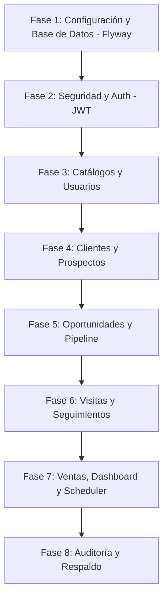

# Plan de Desarrollo Backend — CRM Reactivos del Valle

Análisis y plan de desarrollo para el backend utilizando **Java 21** y **Spring Boot 4** (según el parent de tu `pom.xml`). 

---

## Recomendaciones de Estructura de Paquetes

La estructura de paquetes actual contiene: `controller`, `dto`, `entity`, `exception`, `repository`, `security`, `service`. Para cumplir con las reglas de negocio y arquitectónicas del plan, recomendamos agregar los siguientes paquetes bajo `com.reactivosdelvalle.crm_api`:

1. **`config`**
   - **Razón:** Necesitamos centralizar configuraciones generales del framework que no pertenecen estrictamente a la lógica de negocio ni a la seguridad pura. Por ejemplo:
     - Configuración de CORS y MVC (para permitir peticiones desde React/Vite).
     - Configuración de Swagger/OpenAPI.
     - Configuración de JPA Auditing (para auditar de forma automática campos como `created_at` e integrar `created_by_id`/`updated_by_id` a través de un `AuditorAware`).
2. **`mapper`**
   - **Razón:** El plan menciona **MapStruct** y la regla *"DTOs separados de entidades; nunca exponer entidades JPA directamente"*. Mantener los conversores `Entity ↔ DTO` en su propio paquete evita acoplar el código y mantiene limpios los controladores y servicios.
3. **`scheduler`**
   - **Razón:** La regla de negocio 11 establece respaldos semanales automáticos (`@Scheduled` con cron) y la regla 2 requiere alertas de inactividad diarias. Separar estas tareas programadas (background tasks) de la API REST previene la mezcla de responsabilidades.
4. **`util`**
   - **Razón:** Para clases utilitarias transversales. Por ejemplo, `SecurityUtils` (definida en el plan de roles) para resolver el usuario autenticado actual, obtener su rol o verificar si es propietario de un recurso de manera reutilizable.

---

## Correcciones Críticas Detectadas

Al analizar los archivos del proyecto, detectamos el siguiente detalle en el archivo [`application.properties`](file:///c:/Users/VITALLAB/Desktop/crm-api/src/main/resources/application.properties):

> [!WARNING]
> En la línea 7, la URL de la base de datos es:
> `spring.datasource.url=jdbc:postgresql//ep-rapid-sea-axmhiz8b-pooler...`
> Falta el carácter `:` después de `postgresql`. Debe ser:
> `spring.datasource.url=jdbc:postgresql://ep-rapid-sea-axmhiz8b-pooler...`

---

## Propuesta de Fases de Desarrollo

Para abordar la construcción del backend de manera ordenada y segura, dividimos el desarrollo en las siguientes fases lógicas:

### Fase 1: Configuración Inicial y Base de Datos (Flyway)
1. Corregir la URL del datasource en `application.properties`.
2. Crear los archivos de migración de Flyway en `src/main/resources/db/migration/` para estructurar la base de datos (enums, tablas base, índices y llaves foráneas).
3. Insertar datos iniciales (`seed`) de catálogos y un usuario administrador inicial con contraseña encriptada (BCrypt).

### Fase 2: Configuración de Seguridad y Autenticación (JWT)
1. Implementar las clases de seguridad:
   - Configuración de Spring Security (`SecurityConfig` habilitando `@EnableMethodSecurity`).
   - Filtro de JWT (`JwtAuthenticationFilter`) y proveedor/utilitario de tokens (`JwtUtils`).
   - Servicio para cargar detalles del usuario (`CustomUserDetailsService`, `UsuarioPrincipal`).
2. Crear `AuthController` y los endpoints de login/refresh token.

### Fase 3: Catálogos y Usuarios (Administración)
1. Crear las entidades, repositorios, DTOs y servicios para `Usuario` y `Catalogo`.
2. Habilitar controladores administrativos para gestionar usuarios y catálogos, limitando acceso con `@PreAuthorize("hasRole('ADMIN')")`.

### Fase 4: Clientes, Contactos y Prospectos
1. Crear entidades para `Cliente`, `Contacto` y `Prospecto` con borrado lógico (`activo = true/false`).
2. Diseñar el flujo de conversión de Prospecto a Cliente.
3. Aplicar las reglas de negocio (Rule 5: Prospectos obligatorios) y filtros por propiedad (Ejecutivo solo ve/edita lo suyo, Gerente/Admin ve todo).

### Fase 5: Oportunidades y Pipeline (Kanban)
1. Crear la entidad `Oportunidad` aplicando la **Regla de Oro** en el DTO de request y validación en base de datos.
2. Calcular en tiempo real el valor ponderado (`valor * probabilidad / 100`).
3. Registrar automáticamente el historial de cambios de etapa en la tabla `oportunidad_etapas_hist` usando JPA Entity Listeners o disparadores en el Service.

### Fase 6: Visitas y Seguimientos
1. Crear la entidad `Visita` con validación de fecha (máximo 24h atrás) y los 7 campos obligatorios.
2. Crear la entidad `Seguimiento` calculando los `dias_vencidos` de forma dinámica en la consulta.

### Fase 7: Metas de Ventas y Dashboard
1. Crear la entidad `Venta` con la restricción única `(ejecutivo_id, anio, mes)`.
2. Crear endpoints del Dashboard para consolidar KPIs y alertas de inactividad comercial (> 24h).

### Fase 8: Auditoría Automática y Respaldos (pg_dump)
1. Implementar la auditoría automática con un Listener JPA (`AuditListener`) que registre inserciones, actualizaciones y borrados lógicos en la tabla `auditoria`.
2. Configurar el scheduler (`BackupScheduler`) para ejecutar el respaldo semanal de PostgreSQL.

---

## Plan de Verificación

### Pruebas Automatizadas
- Pruebas unitarias de las reglas de negocio críticas (Regla de Oro, fecha de visita <= 24h, filtros de visualización por rol) usando JUnit 5 y Mockito.
- Pruebas de integración del flujo de autenticación y endpoints principales.

### Verificación Manual
- Utilizar Swagger UI (en `/swagger-ui.html` u OpenAPI 3) para probar interactivamente cada endpoint a medida que se desarrolla.
- Validar las restricciones de base de datos directamente con consultas en la instancia de Neon PostgreSQL.
